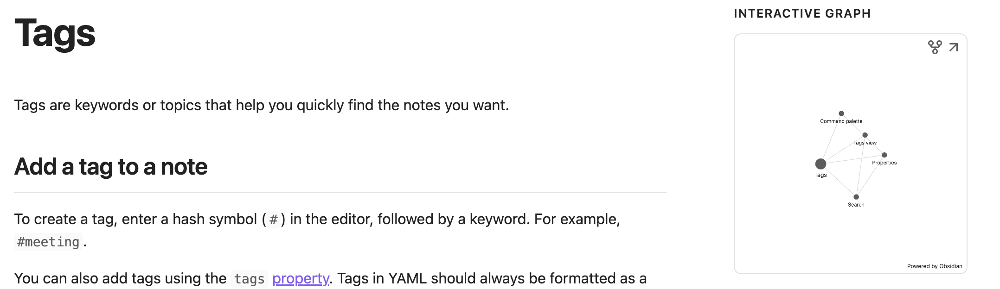

import { ArticleLayout } from '@/components/ArticleLayout'

export const article = {
  author: 'Sherod Taylor',
  date: '2024-01-07',
  title: 'Developing a system for effective leadership',
  description:
    'Developing a system for effective leadership and managing the chaos',
}

export const metadata = {
  title: article.title,
  description: article.description,
}

export default (props) => <ArticleLayout article={article} {...props} />

## Why you need a system

You need a system to effectively manage the chaos. To efficiently navigate the complexities
inherent in transitioning from an individual contributor to a leadership role, a systematic
approach is essential. Many new leaders struggle with context switching, a skill critical in leadership
positions. Unlike individual contributions, leadership involves a diverse array of engagements, from
discussing project deadlines to focusing on team members' personal development in varying
meetings. Establishing a system to manage these varied responsibilities is key to a successful transition.

### Finding your system

It's not easy find a system that works for you. For example some maybe good with remembering everything
and I am not one of those people. I found once I transistioned I needed to talk a lot more notes.
In 1 on 1's with team members struggled to remember what meetings I had prior and had 30 more pages of notes
Within the first couple of days. While it helped me build my memory this wasn't scaling for me.
To manage I tried blocking time off once a week to organize all the notes on sheets of paper.
This was hard to stick to with my schedule and required a lot of manual work. I realized I had to
figure out another way.

### My journey

Enter [Obsidian](http://obsidian.md), a transformative application for my workflow. As a staunch advocate
for privacy, I appreciate not having to share my data with third-party providers.
[Obsidian](http://obsidian.md) stands out as a Markdown-based note editor, enriched by a robust
plugin ecosystem. It enables efficient search and interlinking of notes through
[tags](https://help.obsidian.md/Editing+and+formatting/Tags), creating an
interactive graph of all connected notes.

This functionality has empowered me to construct a comprehensive map of my notes. Particularly, its to-do list feature
has significantly eased the burden of context switching, proving invaluable during remote meetings.
However, in-person interactions, such as back-to-back meetings and 1-on-1s, presented
a challenge for real-time note-taking.

Now it became hard to take notes realtime as we were in person and there was so much information
to digest. Going to back to back meetings made it feel impossible to take notes in between them.
My system was now missing a way to take notes in person. This lead me to integrating
[Supernote](https://supernote.com/) in to my workflow. [Supernote](https://supernote.com/)
has become indispensable for in-person note-taking, allowing seamless synchronization with
my Obsidian vault via Google Drive.

### How it's been Going

It's been almost a year since setting up this system. I found this to be extremely helpful
with long running projects and old conversations. It's how I've been tracking
everything I need to do. With so much context switching in management you need a system
to manage the chaos.
